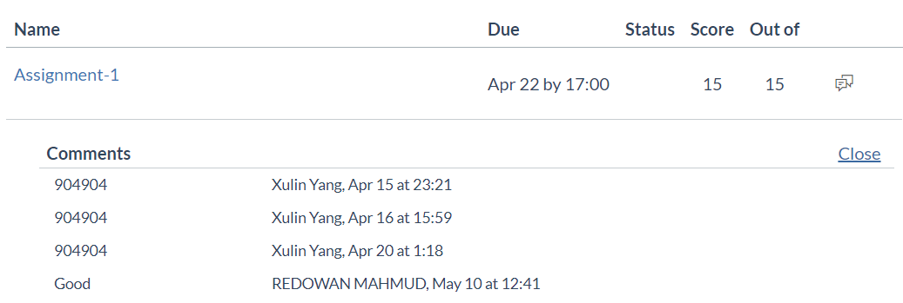

# multi-threaded-simpleDictionary-server
COMP90015 - Distributed System - 2020S1

## How to run
1. Ensure maven is installed
```mvn -v```
2. install dependency
```mvn install```
3. run server  
```cd output/artifacts/DictionaryServer```  
```java -Duser.language=en -jar DictionaryServer.jar 49153 ../../../src/main/java/com/unimelb/comp90015/Server/dictionary.json 8 10 50```
4. run client  
```cd output/artifacts/DictionaryClient```  
```java -Duser.language=en -jar DictionaryClient.jar 127.0.0.1 49153 1```

## How to package jar
```mvn package assembly:single```

## results
15/15


